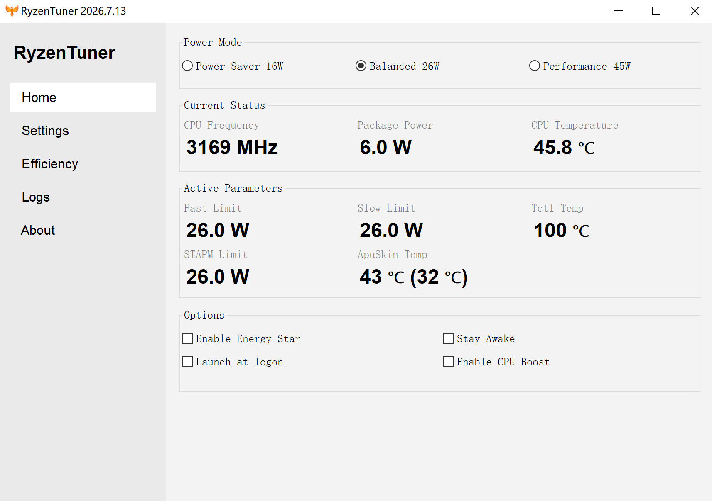
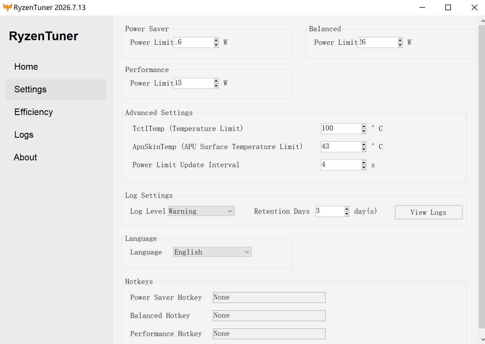
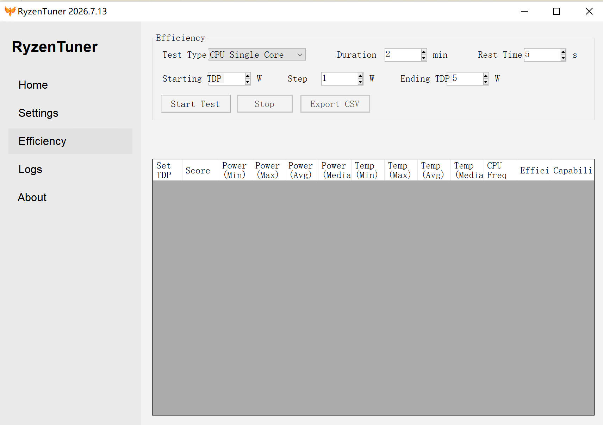
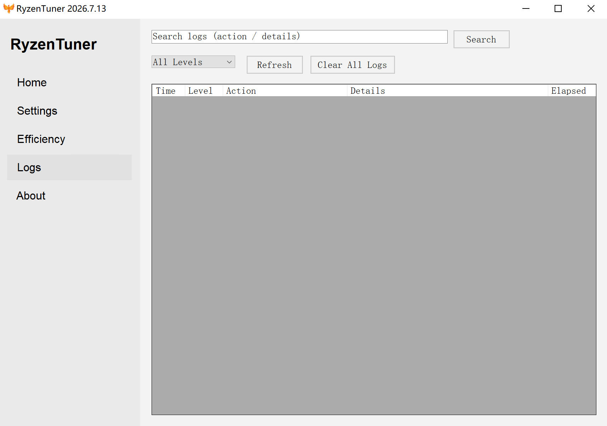
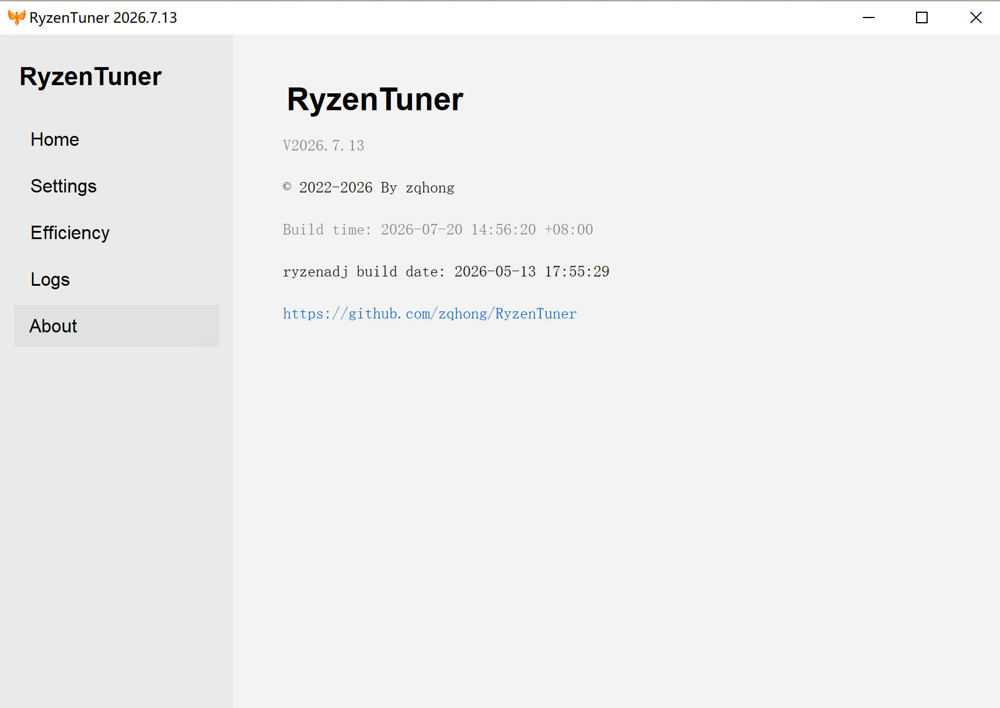

# RyzenTuner

RyzenTuner provides a GUI for adjusting the power limits of Ryzen mobile processors. It also lets you tune the QoS level and priority of Windows processes to improve battery life and reduce fan noise.

## Features

## Usage

You can download the prebuilt application from [Releases](https://github.com/zqhong/RyzenTuner/releases).

### Prerequisites

- **Microsoft Visual C++ 2015-2022 Redistributable (x64)** — Required by `libryzenadj.dll`.
  Download: https://aka.ms/vs/17/release/vc_redist.x64.exe

## License

RyzenTuner is licensed under [MIT](LICENSE.md).
